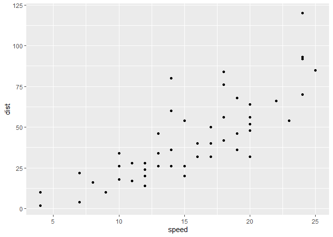
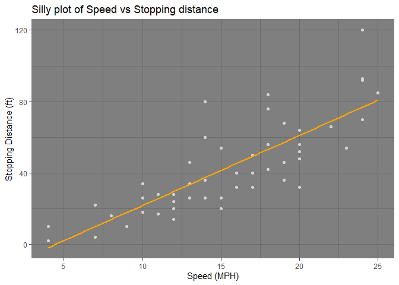
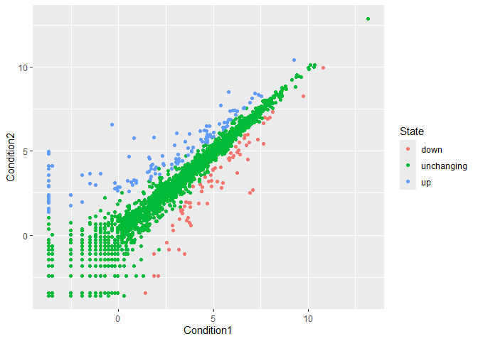
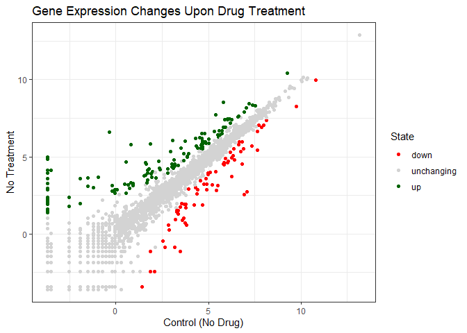
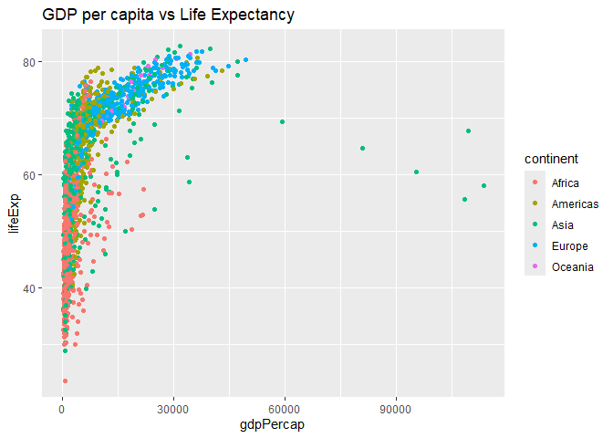
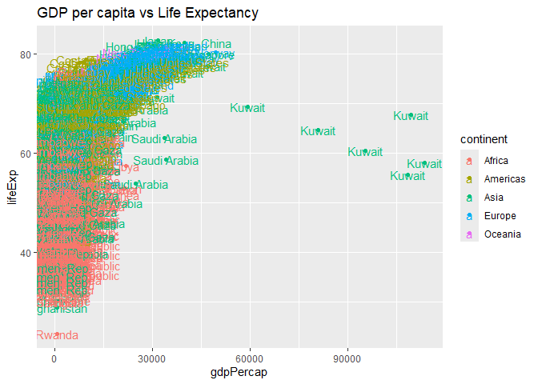
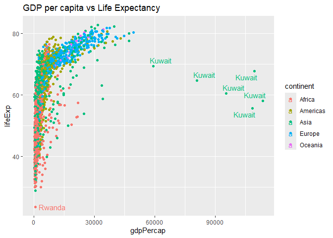
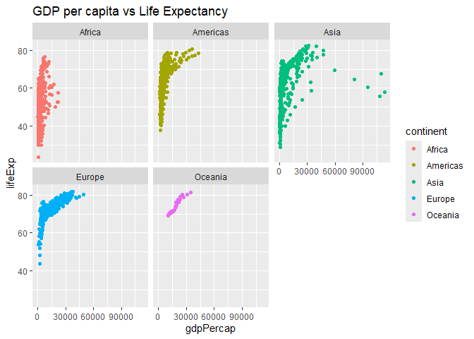

# Class 5: Data Viz with ggplot
Alejandro Ostos (PID: A17978684)

Today we are exploring the **ggplot** package and how to make nice
figures in R.

There are lots of ways to make figures and plot in R. These include:

- so called “base” R
- and add on packages like **ggplot2**

Here is a simple “base” R plot.

``` r
head(cars)
```

      speed dist
    1     4    2
    2     4   10
    3     7    4
    4     7   22
    5     8   16
    6     9   10

We can simply pass to the `plot()` function

``` r
plot(cars)
```


> Key-point: Base R is quick but not so nice and simple looking in some
> folk eyes.

Let’s see how we can plot this with **ggplot2**

1st I need to install this add on package. For this we use the
`install.packages()` function. **WE DO THIS IN THE CONSOLE, NOT OUR
REPORT** This is a one time thing.

2nd We need to load the package with the `library()`

``` r
library(ggplot2)
ggplot(cars)
```


Every ggplot is composed of at least three layers: - **data** (i.e. a
data.frame with the things you want to plot) - aesthetics **aes()** that
map the columns of data to your plot features (i.e. aesthetics) - geoms
like **geom_point()** that srt how the plot aappears

``` r
ggplot(cars) +
  aes( x = speed, y = dist) +
  geom_point()
```



> For simple “canned” graphs base R is quicker but as things get more
> custom and elaborate then ggplot wins out…

Let’s add more layers to our ggplot

Add a line showing a relationship between x and y Add a Title Add custom
axis labels “Speed (MPH)” and “Distance (ft)” Change the theme…

``` r
ggplot(cars) +
  aes( x = speed, y = dist) +
  geom_point(color = "lightgray") +
  geom_smooth(method = lm, se = F, color = "orange") +
  labs(title = "Silly plot of Speed vs Stopping distance",
       x = "Speed (MPH)",
       y = "Stopping Distance (ft)") +
  theme_dark()
```

    `geom_smooth()` using formula = 'y ~ x'



## Going Further

Read some gene expression data

``` r
url <- "https://bioboot.github.io/bimm143_S20/class-material/up_down_expression.txt"
genes <- read.delim(url)
head(genes)
```

            Gene Condition1 Condition2      State
    1      A4GNT -3.6808610 -3.4401355 unchanging
    2       AAAS  4.5479580  4.3864126 unchanging
    3      AASDH  3.7190695  3.4787276 unchanging
    4       AATF  5.0784720  5.0151916 unchanging
    5       AATK  0.4711421  0.5598642 unchanging
    6 AB015752.4 -3.6808610 -3.5921390 unchanging

> Q1. How many genes are in this wee dataset?

``` r
nrow(genes)
```

    [1] 5196

``` r
ncol(genes)
```

    [1] 4

> Q2. How many “up” regulated genes are there?

``` r
upreg <- genes$State == "up"
sum(upreg)
```

    [1] 127

A useful function for counting up occurances of things in a vector is
the `table()` function.

``` r
table(genes$State)
```


          down unchanging         up 
            72       4997        127 

``` r
p <- ggplot(genes) + 
    aes(x = Condition1, y = Condition2, colour = State) +
    geom_point()
p
```



``` r
p <- p + scale_colour_manual( values=c("red","lightgray","darkgreen") ) +
  theme_bw() +
  labs( title = "Gene Expression Changes Upon Drug Treatment",
        x = "Control (No Drug)",
        y = "No Treatment")

p
```



\##More Plotting

Read the gapminder dataset

``` r
url <- "https://raw.githubusercontent.com/jennybc/gapminder/master/inst/extdata/gapminder.tsv"

gapminder <- read.delim(url)
```

Let’s have a wee peak

``` r
head(gapminder, 3)
```

          country continent year lifeExp      pop gdpPercap
    1 Afghanistan      Asia 1952  28.801  8425333  779.4453
    2 Afghanistan      Asia 1957  30.332  9240934  820.8530
    3 Afghanistan      Asia 1962  31.997 10267083  853.1007

``` r
tail(gapminder, 3)
```

          country continent year lifeExp      pop gdpPercap
    1702 Zimbabwe    Africa 1997  46.809 11404948  792.4500
    1703 Zimbabwe    Africa 2002  39.989 11926563  672.0386
    1704 Zimbabwe    Africa 2007  43.487 12311143  469.7093

> Q4. How many different country values are in this dataset?

``` r
length(table(gapminder$country))
```

    [1] 142

> Q5. How many different continent values are in this dataset

``` r
length(table(gapminder$continent))
```

    [1] 5

``` r
ggplot(gapminder) +
  aes(gdpPercap, lifeExp, col = continent) +
  geom_point() +
  labs(title = "GDP per capita vs Life Expectancy") 
```



``` r
ggplot(gapminder) +
  aes(gdpPercap, lifeExp, col = continent, label = country) +
  geom_point() +
  labs(title = "GDP per capita vs Life Expectancy") +
  geom_text()
```



I can use **ggrepel** package to make more sensible labels here.

``` r
library(ggrepel)
ggplot(gapminder) +
  aes(gdpPercap, lifeExp, col = continent, label = country) +
  geom_point() +
  labs(title = "GDP per capita vs Life Expectancy") +
  geom_text_repel() 
```

    Warning: ggrepel: 1697 unlabeled data points (too many overlaps). Consider
    increasing max.overlaps



I want a seperate pannel per continent

``` r
ggplot(gapminder) +
  aes(gdpPercap, lifeExp, col = continent, label = country) +
  geom_point() +
  labs(title = "GDP per capita vs Life Expectancy") +
  facet_wrap(~continent)
```



The main advantages of ggplot over base R plot are:

1.  **Layered Grammar of Graphics**: ggplot uses a consistent, layered
    approach where you build plots by adding layers (data, aesthetics,
    geoms, themes) with the + operator. This makes complex plots easier
    to construct and modify
    [\[1\]](https://drive.google.com/file/d/1BYSWJLROqxA1YpuDhJkzUolhiZqiOOKg/view?usp=drivesdk),
    [\[3\]](https://drive.google.com/file/d/1tFqKg9_nhVMmKYfiM1CQKDS2PmPwLh8n/view?usp=drivesdk),
    [\[2\]](https://drive.google.com/file/d/1Clw2_EJ_hY3USNwObiPnxpIQIfirxfW0/view?usp=drivesdk),
    [\[5\]](https://drive.google.com/file/d/15xXaaIcCWOc_x1gJLdySWOd_sfMXTiaw/view?usp=drivesdk),
    [\[4\]](https://drive.google.com/file/d/1FDBbIi2Rlw2In9mClB7Mub8oUPgx6y8h/view?usp=drivesdk).

2.  **Declarative Syntax**: You specify *what* you want to show (data
    mappings, aesthetics) rather than *how* to draw each element. This
    leads to more readable and maintainable code
    [\[1\]](https://drive.google.com/file/d/1BYSWJLROqxA1YpuDhJkzUolhiZqiOOKg/view?usp=drivesdk),
    [\[3\]](https://drive.google.com/file/d/1tFqKg9_nhVMmKYfiM1CQKDS2PmPwLh8n/view?usp=drivesdk),
    [\[2\]](https://drive.google.com/file/d/1Clw2_EJ_hY3USNwObiPnxpIQIfirxfW0/view?usp=drivesdk),
    [\[5\]](https://drive.google.com/file/d/15xXaaIcCWOc_x1gJLdySWOd_sfMXTiaw/view?usp=drivesdk),
    [\[4\]](https://drive.google.com/file/d/1FDBbIi2Rlw2In9mClB7Mub8oUPgx6y8h/view?usp=drivesdk).

3.  **Beautiful Defaults**: ggplot produces publication-quality figures
    with attractive default styles, reducing the need for manual
    tweaking
    [\[1\]](https://drive.google.com/file/d/1BYSWJLROqxA1YpuDhJkzUolhiZqiOOKg/view?usp=drivesdk),
    [\[3\]](https://drive.google.com/file/d/1tFqKg9_nhVMmKYfiM1CQKDS2PmPwLh8n/view?usp=drivesdk),
    [\[2\]](https://drive.google.com/file/d/1Clw2_EJ_hY3USNwObiPnxpIQIfirxfW0/view?usp=drivesdk),
    [\[5\]](https://drive.google.com/file/d/15xXaaIcCWOc_x1gJLdySWOd_sfMXTiaw/view?usp=drivesdk),
    [\[4\]](https://drive.google.com/file/d/1FDBbIi2Rlw2In9mClB7Mub8oUPgx6y8h/view?usp=drivesdk).

4.  **Customization and Extensibility**: It’s easier to add custom
    layers, annotations, and themes, and to map variables to visual
    features like color, size, and shape
    [\[1\]](https://drive.google.com/file/d/1BYSWJLROqxA1YpuDhJkzUolhiZqiOOKg/view?usp=drivesdk),
    [\[3\]](https://drive.google.com/file/d/1tFqKg9_nhVMmKYfiM1CQKDS2PmPwLh8n/view?usp=drivesdk),
    [\[2\]](https://drive.google.com/file/d/1Clw2_EJ_hY3USNwObiPnxpIQIfirxfW0/view?usp=drivesdk),
    [\[5\]](https://drive.google.com/file/d/15xXaaIcCWOc_x1gJLdySWOd_sfMXTiaw/view?usp=drivesdk),
    [\[4\]](https://drive.google.com/file/d/1FDBbIi2Rlw2In9mClB7Mub8oUPgx6y8h/view?usp=drivesdk).

5.  **Consistency Across Plot Types**: The same grammar applies to
    scatter plots, bar plots, box plots, etc., making it easier to learn
    and use for different visualizations
    [\[1\]](https://drive.google.com/file/d/1BYSWJLROqxA1YpuDhJkzUolhiZqiOOKg/view?usp=drivesdk),
    [\[3\]](https://drive.google.com/file/d/1tFqKg9_nhVMmKYfiM1CQKDS2PmPwLh8n/view?usp=drivesdk),
    [\[2\]](https://drive.google.com/file/d/1Clw2_EJ_hY3USNwObiPnxpIQIfirxfW0/view?usp=drivesdk),
    [\[5\]](https://drive.google.com/file/d/15xXaaIcCWOc_x1gJLdySWOd_sfMXTiaw/view?usp=drivesdk),
    [\[4\]](https://drive.google.com/file/d/1FDBbIi2Rlw2In9mClB7Mub8oUPgx6y8h/view?usp=drivesdk).

Base R plots are quick for simple visualizations but can be fiddly and
time-consuming to refine for publication-quality output
[\[1\]](https://drive.google.com/file/d/1BYSWJLROqxA1YpuDhJkzUolhiZqiOOKg/view?usp=drivesdk),
[\[3\]](https://drive.google.com/file/d/1tFqKg9_nhVMmKYfiM1CQKDS2PmPwLh8n/view?usp=drivesdk),
[\[2\]](https://drive.google.com/file/d/1Clw2_EJ_hY3USNwObiPnxpIQIfirxfW0/view?usp=drivesdk),
[\[5\]](https://drive.google.com/file/d/15xXaaIcCWOc_x1gJLdySWOd_sfMXTiaw/view?usp=drivesdk),
[\[4\]](https://drive.google.com/file/d/1FDBbIi2Rlw2In9mClB7Mub8oUPgx6y8h/view?usp=drivesdk).

Which of these advantages do you think would be most useful for your
work?
