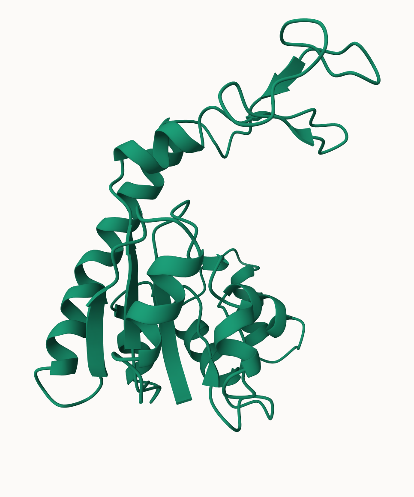

# Class 9: Structural Bioinformatics Part 1
Alejandro Ostos (PID A17978684)

## The PDB database

Download a CSV file from the PDB site (accessible from “Analyze” \> “PDB
Statistics” \> “by Experimental Method and Molecular Type”. Move this
CSV file into your RStudio project and use it to answer the following
questions:

``` r
stats <- read.csv("Data Export Summary.csv")
stats
```

               Molecular.Type   X.ray     EM    NMR Integrative Multiple.methods
    1          Protein (only) 176,204 20,299 12,708         342              218
    2 Protein/Oligosaccharide  10,279  3,385     34           8               11
    3              Protein/NA   9,007  5,897    287          24                7
    4     Nucleic acid (only)   3,066    200  1,553           2               15
    5                   Other     173     13     33           3                0
    6  Oligosaccharide (only)      11      0      6           0                1
      Neutron Other   Total
    1      83    32 209,886
    2       1     0  13,718
    3       0     0  15,222
    4       3     1   4,840
    5       0     0     222
    6       0     4      22

``` r
stats$Total
```

    [1] "209,886" "13,718"  "15,222"  "4,840"   "222"     "22"     

There are not numeric…

``` r
library(readr)
stats <- read_csv("Data Export Summary.csv")
stats
```

    # A tibble: 6 × 9
      `Molecular Type`    `X-ray`    EM   NMR Integrative `Multiple methods` Neutron
      <chr>                 <dbl> <dbl> <dbl>       <dbl>              <dbl>   <dbl>
    1 Protein (only)       176204 20299 12708         342                218      83
    2 Protein/Oligosacch…   10279  3385    34           8                 11       1
    3 Protein/NA             9007  5897   287          24                  7       0
    4 Nucleic acid (only)    3066   200  1553           2                 15       3
    5 Other                   173    13    33           3                  0       0
    6 Oligosaccharide (o…      11     0     6           0                  1       0
    # ℹ 2 more variables: Other <dbl>, Total <dbl>

``` r
n.total <- sum(stats$Total)
n.total
```

    [1] 243910

> Q1: What percentage of structures in the PDB are solved by X-Ray and
> Electron Microscopy. Give your answer to 2 significant figures.

``` r
n.xray <- sum(stats$`X-ray`)
xray_structures <- (n.xray / n.total)*100
round(xray_structures, 2)
```

    [1] 81.48

81.48% are X-ray

``` r
n.em <- sum(stats$EM)
em_structures <- (n.em / n.total)*100
round(em_structures, 2)
```

    [1] 12.22

12.22% are EM

> Q2: What proportion of structures in the PDB are protein?

``` r
n.protein <-  sum(stats$Total[1:3])
prot_structures <- (n.protein/n.total)*100
round(prot_structures, 2)
```

    [1] 97.92

> Q3: Type HIV in the PDB website search box on the home page and
> determine how many HIV-1 protease structures are in the current PDB?

There are 1,150 HIV-1 protease structures in the current PDB.

## Exploring PDB structures

Package for structural bioinformatics

``` r
library(bio3d)
hiv <- read.pdb("1hsg")
```

      Note: Accessing on-line PDB file

``` r
hiv
```


     Call:  read.pdb(file = "1hsg")

       Total Models#: 1
         Total Atoms#: 1686,  XYZs#: 5058  Chains#: 2  (values: A B)

         Protein Atoms#: 1514  (residues/Calpha atoms#: 198)
         Nucleic acid Atoms#: 0  (residues/phosphate atoms#: 0)

         Non-protein/nucleic Atoms#: 172  (residues: 128)
         Non-protein/nucleic resid values: [ HOH (127), MK1 (1) ]

       Protein sequence:
          PQITLWQRPLVTIKIGGQLKEALLDTGADDTVLEEMSLPGRWKPKMIGGIGGFIKVRQYD
          QILIEICGHKAIGTVLVGPTPVNIIGRNLLTQIGCTLNFPQITLWQRPLVTIKIGGQLKE
          ALLDTGADDTVLEEMSLPGRWKPKMIGGIGGFIKVRQYDQILIEICGHKAIGTVLVGPTP
          VNIIGRNLLTQIGCTLNF

    + attr: atom, xyz, seqres, helix, sheet,
            calpha, remark, call

Let’s first use the Mol\* viewer to explore this structrue.

.png)

> Q4: Water molecules normally have 3 atoms. Why do we see just one atom
> per water molecule in this structure?

We only see one atom because hydrogens are ommited to avoid clustering
and improve visibility. Also, in real models hydrogens are difficult to
see and including them would not accurate describe the reality. We
assume they are there.

> Q5: There is a critical “conserved” water molecule in the binding
> site. Can you identify this water molecule? What residue number does
> this water molecule have

HOH 308

> Q6:  \## PDB objects in R

Extract the sequence

``` r
pdbseq(hiv)
```

      1   2   3   4   5   6   7   8   9  10  11  12  13  14  15  16  17  18  19  20 
    "P" "Q" "I" "T" "L" "W" "Q" "R" "P" "L" "V" "T" "I" "K" "I" "G" "G" "Q" "L" "K" 
     21  22  23  24  25  26  27  28  29  30  31  32  33  34  35  36  37  38  39  40 
    "E" "A" "L" "L" "D" "T" "G" "A" "D" "D" "T" "V" "L" "E" "E" "M" "S" "L" "P" "G" 
     41  42  43  44  45  46  47  48  49  50  51  52  53  54  55  56  57  58  59  60 
    "R" "W" "K" "P" "K" "M" "I" "G" "G" "I" "G" "G" "F" "I" "K" "V" "R" "Q" "Y" "D" 
     61  62  63  64  65  66  67  68  69  70  71  72  73  74  75  76  77  78  79  80 
    "Q" "I" "L" "I" "E" "I" "C" "G" "H" "K" "A" "I" "G" "T" "V" "L" "V" "G" "P" "T" 
     81  82  83  84  85  86  87  88  89  90  91  92  93  94  95  96  97  98  99   1 
    "P" "V" "N" "I" "I" "G" "R" "N" "L" "L" "T" "Q" "I" "G" "C" "T" "L" "N" "F" "P" 
      2   3   4   5   6   7   8   9  10  11  12  13  14  15  16  17  18  19  20  21 
    "Q" "I" "T" "L" "W" "Q" "R" "P" "L" "V" "T" "I" "K" "I" "G" "G" "Q" "L" "K" "E" 
     22  23  24  25  26  27  28  29  30  31  32  33  34  35  36  37  38  39  40  41 
    "A" "L" "L" "D" "T" "G" "A" "D" "D" "T" "V" "L" "E" "E" "M" "S" "L" "P" "G" "R" 
     42  43  44  45  46  47  48  49  50  51  52  53  54  55  56  57  58  59  60  61 
    "W" "K" "P" "K" "M" "I" "G" "G" "I" "G" "G" "F" "I" "K" "V" "R" "Q" "Y" "D" "Q" 
     62  63  64  65  66  67  68  69  70  71  72  73  74  75  76  77  78  79  80  81 
    "I" "L" "I" "E" "I" "C" "G" "H" "K" "A" "I" "G" "T" "V" "L" "V" "G" "P" "T" "P" 
     82  83  84  85  86  87  88  89  90  91  92  93  94  95  96  97  98  99 
    "V" "N" "I" "I" "G" "R" "N" "L" "L" "T" "Q" "I" "G" "C" "T" "L" "N" "F" 

``` r
chainA_seq <- pdbseq(trim.pdb(hiv, chain = "A"))
```

I can interactively view these PDB objects in R with the new
**bio3dview** package.

``` r
library(bio3dview)
#view.pdb(hiv)
```

``` r
library(bio3dview)
#sel <- atom.select(hiv, resno = 25)
#view.pdb(hiv, highlight = sel, highlight.style = "spacefill", colorScheme = "chain", col = c("blue", "orange"), backgroundColor = "pink")
```

## Predict protein flexibility

We can run a bioinformatics calculation to predict protein dynamics -
i.e. functional motions.

``` r
adk <- read.pdb("6s36")
```

      Note: Accessing on-line PDB file
       PDB has ALT records, taking A only, rm.alt=TRUE

``` r
adk
```


     Call:  read.pdb(file = "6s36")

       Total Models#: 1
         Total Atoms#: 1898,  XYZs#: 5694  Chains#: 1  (values: A)

         Protein Atoms#: 1654  (residues/Calpha atoms#: 214)
         Nucleic acid Atoms#: 0  (residues/phosphate atoms#: 0)

         Non-protein/nucleic Atoms#: 244  (residues: 244)
         Non-protein/nucleic resid values: [ CL (3), HOH (238), MG (2), NA (1) ]

       Protein sequence:
          MRIILLGAPGAGKGTQAQFIMEKYGIPQISTGDMLRAAVKSGSELGKQAKDIMDAGKLVT
          DELVIALVKERIAQEDCRNGFLLDGFPRTIPQADAMKEAGINVDYVLEFDVPDELIVDKI
          VGRRVHAPSGRVYHVKFNPPKVEGKDDVTGEELTTRKDDQEETVRKRLVEYHQMTAPLIG
          YYSKEAEAGNTKYAKVDGTKPVAEVRADLEKILG

    + attr: atom, xyz, seqres, helix, sheet,
            calpha, remark, call

> Q7: How many amino acid residues are there in this pdb object?

There are 214 amino acid residues in this pdb object.

> Q8: Name one of the two non-protein residues?

In this case there are more than two but one of them is CL.

> Q9: How many protein chains are in this structure?

There is only one protein chain.

``` r
m <- nma(adk)
```

     Building Hessian...        Done in 0.05 seconds.
     Diagonalizing Hessian...   Done in 0.56 seconds.

``` r
plot(m)
```


Generate a “trajectory” of predicted motion

``` r
mktrj(m, file = "ADK_nma.pdb")
```


