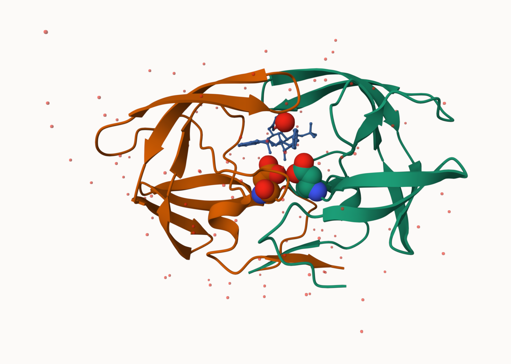

## The PDB database

Download a CSV file from the PDB site (accessible from “Analyze” > “PDB Statistics” > “by Experimental Method and Molecular Type”. Move this CSV file into your RStudio project and use it to answer the following questions:

```{r}
stats <- read.csv("Data Export Summary.csv")
stats
```


```{r}
stats$Total
```
There are not numeric...

```{r pdbstats, message = F}
library(readr)
stats <- read_csv("Data Export Summary.csv")
stats
```
```{r}
n.total <- sum(stats$Total)
n.total
```

>Q1: What percentage of structures in the PDB are solved by X-Ray and Electron Microscopy. Give your answer to 2 significant figures.

```{r}
n.xray <- sum(stats$`X-ray`)
xray_structures <- (n.xray / n.total)*100
round(xray_structures, 2)

```
81.48% are X-ray

```{r}
n.em <- sum(stats$EM)
em_structures <- (n.em / n.total)*100
round(em_structures, 2)
```
12.22% are EM

>Q2: What proportion of structures in the PDB are protein?

```{r}
n.protein <-  sum(stats$Total[1:3])
prot_structures <- (n.protein/n.total)*100
round(prot_structures, 2)
```

>Q3: Type HIV in the PDB website search box on the home page and determine how many HIV-1 protease structures are in the current PDB?

There are 1,150 HIV-1 protease structures in the current PDB.

## Exploring PDB structures

Package for structural bioinformatics

```{r}
library(bio3d)
hiv <- read.pdb("1hsg")
hiv
```
Let's first use the Mol* viewer to explore this structrue. 

.png)

>Q4: Water molecules normally have 3 atoms. Why do we see just one atom per water molecule in this structure?

We only see one atom because hydrogens are ommited to avoid clustering and improve visibility. Also, in real models hydrogens are difficult to see and including them would not accurate describe the reality. We assume they are there.

>Q5: There is a critical “conserved” water molecule in the binding site. Can you identify this water molecule? What residue number does this water molecule have

HOH 308 

>Q6:

## PDB objects in R

Extract the sequence
```{r}
pdbseq(hiv)
```

```{r}
chainA_seq <- pdbseq(trim.pdb(hiv, chain = "A"))
```

I can interactively view these PDB objects in R with the new **bio3dview** package. 

```{r}
library(bio3dview)
#view.pdb(hiv)
```


```{r}
library(bio3dview)
#sel <- atom.select(hiv, resno = 25)
#view.pdb(hiv, highlight = sel, highlight.style = "spacefill", colorScheme = "chain", col = c("blue", "orange"), backgroundColor = "pink")
```


## Predict protein flexibility

We can run a bioinformatics calculation to predict protein dynamics - i.e. functional motions. 
```{r}
adk <- read.pdb("6s36")
adk
```
>Q7: How many amino acid residues are there in this pdb object? 

There are 214 amino acid residues in this pdb object.

>Q8: Name one of the two non-protein residues? 

In this case there are more than two but one of them is CL.

>Q9: How many protein chains are in this structure?

There is only one protein chain.

```{r}
m <- nma(adk)
plot(m)
```

Generate a "trajectory" of predicted motion
```{r}
mktrj(m, file = "ADK_nma.pdb")
```

