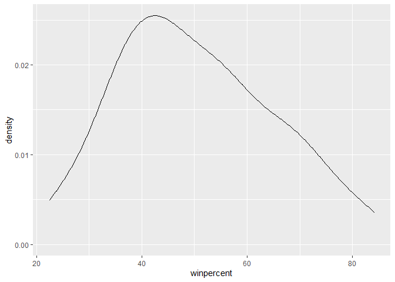
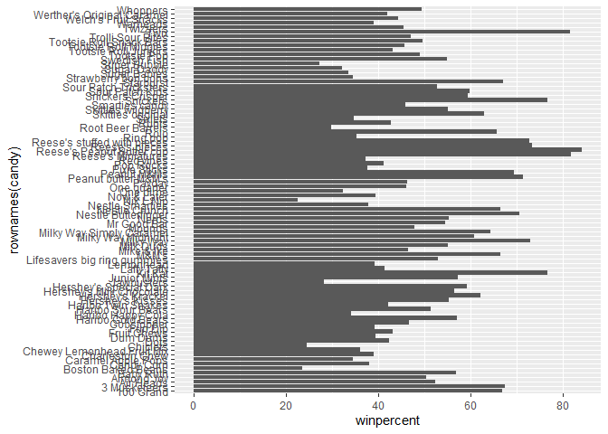
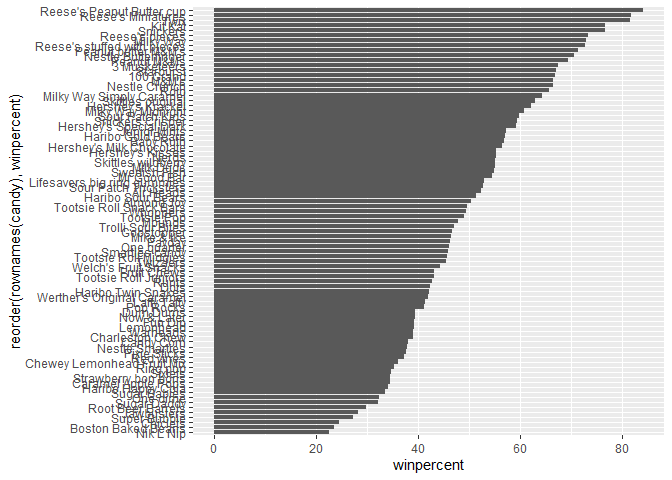
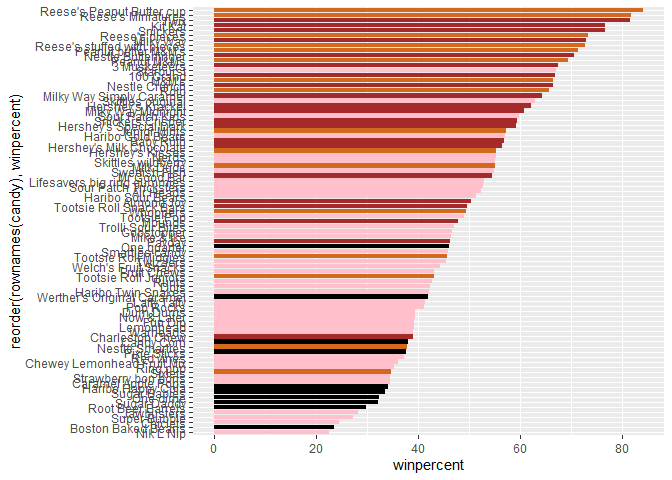
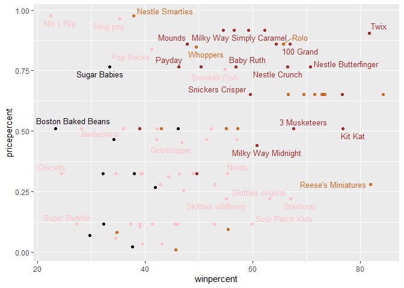
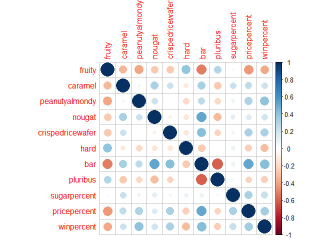
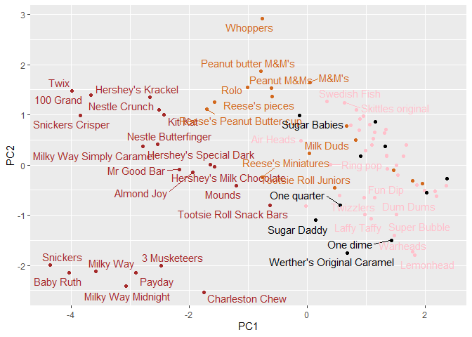
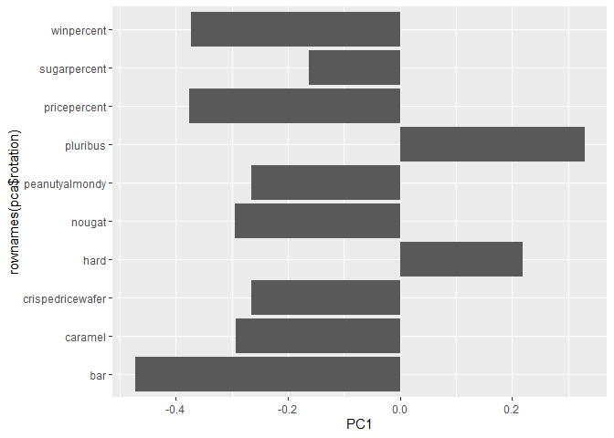
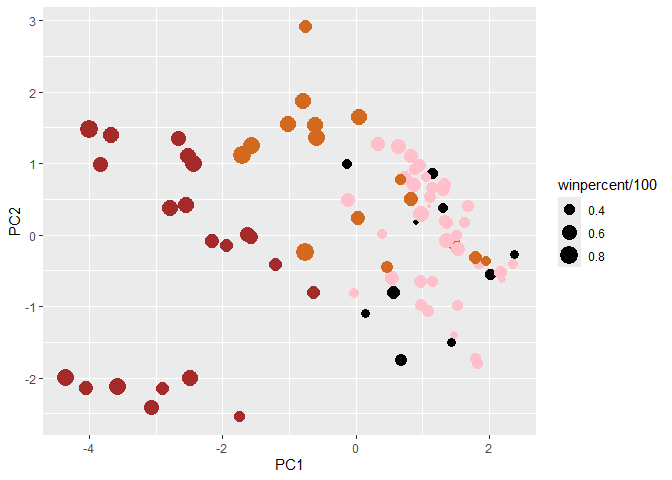
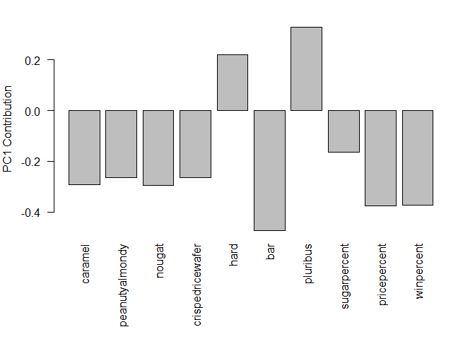

# Class 10: Halloween Mini Project
Alejandro Ostos (PID A17978684)

- [Winpercent and Pricepercent](#winpercent-and-pricepercent)
- [Exploring the correlation
  structure](#exploring-the-correlation-structure)
- [Principal Component Analysis](#principal-component-analysis)

As it is nearly Halloween and the half way point in the quarter let’s do
a mini project to help us figure out the best candy!

Our data comes from the 538 website and is available as a CSV file\>:

``` r
library(readr)
candy <-  read.csv("https://raw.githubusercontent.com/fivethirtyeight/data/master/candy-power-ranking/candy-data.csv", row.names=1)
head(candy)
```

                 chocolate fruity caramel peanutyalmondy nougat crispedricewafer
    100 Grand            1      0       1              0      0                1
    3 Musketeers         1      0       0              0      1                0
    One dime             0      0       0              0      0                0
    One quarter          0      0       0              0      0                0
    Air Heads            0      1       0              0      0                0
    Almond Joy           1      0       0              1      0                0
                 hard bar pluribus sugarpercent pricepercent winpercent
    100 Grand       0   1        0        0.732        0.860   66.97173
    3 Musketeers    0   1        0        0.604        0.511   67.60294
    One dime        0   0        0        0.011        0.116   32.26109
    One quarter     0   0        0        0.011        0.511   46.11650
    Air Heads       0   0        0        0.906        0.511   52.34146
    Almond Joy      0   1        0        0.465        0.767   50.34755

``` r
library(flextable)
flextable::flextable(head(candy))
```


> Q1. How many different candy types are in this dataset?

``` r
library(tidyverse)
candy %>%
  nrow()
```

    [1] 85

> Q2. How many fruity candy types are in the dataset?

``` r
candy$fruity %>%
  sum()
```

    [1] 38

> Q3. What is your favorite candy in the dataset and what is it’s
> winpercent value?

My favourite candy is Trolli so…

``` r
candy["Trolli Sour Bites", ]$winpercent
```

    [1] 47.17323

> Q4. What is the winpercent value for “Kit Kat”?

``` r
candy["Kit Kat", ]$winpercent
```

    [1] 76.7686

> Q5. What is the winpercent value for “Tootsie Roll Snack Bars”?

``` r
candy["Tootsie Roll Snack Bars", ]$winpercent
```

    [1] 49.6535

\## Quick overview of the data set

``` r
library(skimr)
skimr::skim(candy)
```

|                                                  |       |
|:-------------------------------------------------|:------|
| Name                                             | candy |
| Number of rows                                   | 85    |
| Number of columns                                | 12    |
| \_\_\_\_\_\_\_\_\_\_\_\_\_\_\_\_\_\_\_\_\_\_\_   |       |
| Column type frequency:                           |       |
| numeric                                          | 12    |
| \_\_\_\_\_\_\_\_\_\_\_\_\_\_\_\_\_\_\_\_\_\_\_\_ |       |
| Group variables                                  | None  |

Data summary

**Variable type: numeric**

| skim_variable | n_missing | complete_rate | mean | sd | p0 | p25 | p50 | p75 | p100 | hist |
|:---|---:|---:|---:|---:|---:|---:|---:|---:|---:|:---|
| chocolate | 0 | 1 | 0.44 | 0.50 | 0.00 | 0.00 | 0.00 | 1.00 | 1.00 | ▇▁▁▁▆ |
| fruity | 0 | 1 | 0.45 | 0.50 | 0.00 | 0.00 | 0.00 | 1.00 | 1.00 | ▇▁▁▁▆ |
| caramel | 0 | 1 | 0.16 | 0.37 | 0.00 | 0.00 | 0.00 | 0.00 | 1.00 | ▇▁▁▁▂ |
| peanutyalmondy | 0 | 1 | 0.16 | 0.37 | 0.00 | 0.00 | 0.00 | 0.00 | 1.00 | ▇▁▁▁▂ |
| nougat | 0 | 1 | 0.08 | 0.28 | 0.00 | 0.00 | 0.00 | 0.00 | 1.00 | ▇▁▁▁▁ |
| crispedricewafer | 0 | 1 | 0.08 | 0.28 | 0.00 | 0.00 | 0.00 | 0.00 | 1.00 | ▇▁▁▁▁ |
| hard | 0 | 1 | 0.18 | 0.38 | 0.00 | 0.00 | 0.00 | 0.00 | 1.00 | ▇▁▁▁▂ |
| bar | 0 | 1 | 0.25 | 0.43 | 0.00 | 0.00 | 0.00 | 0.00 | 1.00 | ▇▁▁▁▂ |
| pluribus | 0 | 1 | 0.52 | 0.50 | 0.00 | 0.00 | 1.00 | 1.00 | 1.00 | ▇▁▁▁▇ |
| sugarpercent | 0 | 1 | 0.48 | 0.28 | 0.01 | 0.22 | 0.47 | 0.73 | 0.99 | ▇▇▇▇▆ |
| pricepercent | 0 | 1 | 0.47 | 0.29 | 0.01 | 0.26 | 0.47 | 0.65 | 0.98 | ▇▇▇▇▆ |
| winpercent | 0 | 1 | 50.32 | 14.71 | 22.45 | 39.14 | 47.83 | 59.86 | 84.18 | ▃▇▆▅▂ |

> Q6. Is there any variable/column that looks to be on a different scale
> to the majority of the other columns in the dataset?

Winpercent is on a different scale than the rest of variables, because
it does not range between 0 and 1. Although, winpercent is a percentage
which means that it also ranges between 0 and 1. The variables that only
have 0 or 1s are binaries, because they only represent a virtual yes or
no.

> Q7. What do you think a zero and one represent for the
> candy\$chocolate column?

A zero would represent no chocolate, while a 1 would represent
chocolate.

> Q8. Plot a histogram of winpercent values

``` r
library(ggplot2)

ggplot(candy)+
  aes(winpercent)+
  geom_histogram(bins = 20)
```


> Q9. Is the distribution of winpercent values symmetrica?

The distribution is not symmetrical, it is skewed right.

``` r
ggplot(candy)+
  aes(winpercent)+
  geom_density()
```



> Q10. Is the center of the distribution above or below 50%?

``` r
mean(candy$winpercent)
```

    [1] 50.31676

``` r
summary(candy$winpercent)
```

       Min. 1st Qu.  Median    Mean 3rd Qu.    Max. 
      22.45   39.14   47.83   50.32   59.86   84.18 

The center of the distribution is below 50 because the median is 47.83.
This happens even if the mean is above the 50%.

> Q11. On average is chocolate candy higher or lower ranked than fruit
> candy?

``` r
# 1. Find all chocolate candy in the dataset
# 2. Find their winpercent values
# 3. Calculate the mean of these values

# 4-6. Do the same for fruity candy
# 7. Compare mean winpercents for chocolate vs. fruity

choc.inds <- candy$chocolate == 1
choc.win <- candy[choc.inds, ]$winpercent
mean(choc.win)
```

    [1] 60.92153

``` r
frt.inds <- candy$fruity == 1
frt.win <- candy[frt.inds, ]$winpercent
mean(frt.win)
```

    [1] 44.11974

Chocolate candy is on average ranked higher than fruity candy.

> Q12. Is this difference statistically significant?

``` r
t.test(choc.win, frt.win)
```


        Welch Two Sample t-test

    data:  choc.win and frt.win
    t = 6.2582, df = 68.882, p-value = 2.871e-08
    alternative hypothesis: true difference in means is not equal to 0
    95 percent confidence interval:
     11.44563 22.15795
    sample estimates:
    mean of x mean of y 
     60.92153  44.11974 

This means are statistically significant.

> Q13. What are the five least liked candy types in this set?

``` r
candy |>
  arrange(winpercent)|>
  head(5)
```

                       chocolate fruity caramel peanutyalmondy nougat
    Nik L Nip                  0      1       0              0      0
    Boston Baked Beans         0      0       0              1      0
    Chiclets                   0      1       0              0      0
    Super Bubble               0      1       0              0      0
    Jawbusters                 0      1       0              0      0
                       crispedricewafer hard bar pluribus sugarpercent pricepercent
    Nik L Nip                         0    0   0        1        0.197        0.976
    Boston Baked Beans                0    0   0        1        0.313        0.511
    Chiclets                          0    0   0        1        0.046        0.325
    Super Bubble                      0    0   0        0        0.162        0.116
    Jawbusters                        0    1   0        1        0.093        0.511
                       winpercent
    Nik L Nip            22.44534
    Boston Baked Beans   23.41782
    Chiclets             24.52499
    Super Bubble         27.30386
    Jawbusters           28.12744

> Q14. What are the top 5 all time favorite candy types out of this set?

``` r
candy |>
  arrange(-winpercent)|>
  head(5)
```

                              chocolate fruity caramel peanutyalmondy nougat
    Reese's Peanut Butter cup         1      0       0              1      0
    Reese's Miniatures                1      0       0              1      0
    Twix                              1      0       1              0      0
    Kit Kat                           1      0       0              0      0
    Snickers                          1      0       1              1      1
                              crispedricewafer hard bar pluribus sugarpercent
    Reese's Peanut Butter cup                0    0   0        0        0.720
    Reese's Miniatures                       0    0   0        0        0.034
    Twix                                     1    0   1        0        0.546
    Kit Kat                                  1    0   1        0        0.313
    Snickers                                 0    0   1        0        0.546
                              pricepercent winpercent
    Reese's Peanut Butter cup        0.651   84.18029
    Reese's Miniatures               0.279   81.86626
    Twix                             0.906   81.64291
    Kit Kat                          0.511   76.76860
    Snickers                         0.651   76.67378

> Q15. Make a first barplot of candy ranking based on winpercent values.

``` r
ggplot(candy) + 
  aes(winpercent, rownames(candy)) +
  geom_col()
```



> Q16. This is quite ugly, use the reorder() function to get the bars
> sorted by winpercent?

``` r
ggplot(candy)+
  aes(x=winpercent, y=reorder(rownames(candy), winpercent))+
  geom_col()
```



``` r
my_cols=rep("black", nrow(candy))
my_cols[as.logical(candy$chocolate)] = "chocolate"
my_cols[as.logical(candy$bar)] = "brown"
my_cols[as.logical(candy$fruity)] = "pink"

ggplot(candy) + 
  aes(winpercent, reorder(rownames(candy),winpercent)) +
  geom_col(fill=my_cols)
```



> Q17. What is the worst ranked chocolate candy?

Sixlets are the worst ranked chocolate candy.

> Q18. What is the best ranked fruity candy?

Starburst are the best ranked fruity candy.

## Winpercent and Pricepercent

``` r
library(ggrepel)

# How about a plot of price vs win
ggplot(candy) +
  aes(winpercent, pricepercent, label= rownames(candy)) +
  geom_point(col=my_cols) + 
  geom_text_repel(col=my_cols, size=3.3, max.overlaps = 5)
```

    Warning: ggrepel: 54 unlabeled data points (too many overlaps). Consider
    increasing max.overlaps



> Q19. Which candy type is the highest ranked in terms of winpercent for
> the least money - i.e. offers the most bang for your buck?

``` r
candy |>
  mutate(bang_for_buck = winpercent / pricepercent) |>
  arrange(desc(bang_for_buck)) |>
  slice(1)
```

                         chocolate fruity caramel peanutyalmondy nougat
    Tootsie Roll Midgies         1      0       0              0      0
                         crispedricewafer hard bar pluribus sugarpercent
    Tootsie Roll Midgies                0    0   0        1        0.174
                         pricepercent winpercent bang_for_buck
    Tootsie Roll Midgies        0.011   45.73675      4157.886

> Q20. What are the top 5 most expensive candy types in the dataset and
> of these which is the least popular?

``` r
top5_expensive <- candy |>
  arrange(desc(pricepercent)) |>
  head(5)

top5_expensive
```

                             chocolate fruity caramel peanutyalmondy nougat
    Nik L Nip                        0      1       0              0      0
    Nestle Smarties                  1      0       0              0      0
    Ring pop                         0      1       0              0      0
    Hershey's Krackel                1      0       0              0      0
    Hershey's Milk Chocolate         1      0       0              0      0
                             crispedricewafer hard bar pluribus sugarpercent
    Nik L Nip                               0    0   0        1        0.197
    Nestle Smarties                         0    0   0        1        0.267
    Ring pop                                0    1   0        0        0.732
    Hershey's Krackel                       1    0   1        0        0.430
    Hershey's Milk Chocolate                0    0   1        0        0.430
                             pricepercent winpercent
    Nik L Nip                       0.976   22.44534
    Nestle Smarties                 0.976   37.88719
    Ring pop                        0.965   35.29076
    Hershey's Krackel               0.918   62.28448
    Hershey's Milk Chocolate        0.918   56.49050

``` r
least_popular <- top5_expensive |>
  arrange(winpercent) |>
  slice(1)

least_popular
```

              chocolate fruity caramel peanutyalmondy nougat crispedricewafer hard
    Nik L Nip         0      1       0              0      0                0    0
              bar pluribus sugarpercent pricepercent winpercent
    Nik L Nip   0        1        0.197        0.976   22.44534

## Exploring the correlation structure

``` r
candy <- candy[,-1]
cij <- cor(candy)
cij
```

                          fruity     caramel peanutyalmondy      nougat
    fruity            1.00000000 -0.33548538    -0.39928014 -0.26936712
    caramel          -0.33548538  1.00000000     0.05935614  0.32849280
    peanutyalmondy   -0.39928014  0.05935614     1.00000000  0.21311310
    nougat           -0.26936712  0.32849280     0.21311310  1.00000000
    crispedricewafer -0.26936712  0.21311310    -0.01764631 -0.08974359
    hard              0.39067750 -0.12235513    -0.20555661 -0.13867505
    bar              -0.51506558  0.33396002     0.26041960  0.52297636
    pluribus          0.29972522 -0.26958501    -0.20610932 -0.31033884
    sugarpercent     -0.03439296  0.22193335     0.08788927  0.12308135
    pricepercent     -0.43096853  0.25432709     0.30915323  0.15319643
    winpercent       -0.38093814  0.21341630     0.40619220  0.19937530
                     crispedricewafer        hard         bar    pluribus
    fruity                -0.26936712  0.39067750 -0.51506558  0.29972522
    caramel                0.21311310 -0.12235513  0.33396002 -0.26958501
    peanutyalmondy        -0.01764631 -0.20555661  0.26041960 -0.20610932
    nougat                -0.08974359 -0.13867505  0.52297636 -0.31033884
    crispedricewafer       1.00000000 -0.13867505  0.42375093 -0.22469338
    hard                  -0.13867505  1.00000000 -0.26516504  0.01453172
    bar                    0.42375093 -0.26516504  1.00000000 -0.59340892
    pluribus              -0.22469338  0.01453172 -0.59340892  1.00000000
    sugarpercent           0.06994969  0.09180975  0.09998516  0.04552282
    pricepercent           0.32826539 -0.24436534  0.51840654 -0.22079363
    winpercent             0.32467965 -0.31038158  0.42992933 -0.24744787
                     sugarpercent pricepercent winpercent
    fruity            -0.03439296   -0.4309685 -0.3809381
    caramel            0.22193335    0.2543271  0.2134163
    peanutyalmondy     0.08788927    0.3091532  0.4061922
    nougat             0.12308135    0.1531964  0.1993753
    crispedricewafer   0.06994969    0.3282654  0.3246797
    hard               0.09180975   -0.2443653 -0.3103816
    bar                0.09998516    0.5184065  0.4299293
    pluribus           0.04552282   -0.2207936 -0.2474479
    sugarpercent       1.00000000    0.3297064  0.2291507
    pricepercent       0.32970639    1.0000000  0.3453254
    winpercent         0.22915066    0.3453254  1.0000000

``` r
library(corrplot)
```

    corrplot 0.95 loaded

``` r
cij <- cor(candy)
corrplot(cij)
```



> Q22. Examining this plot what two variables are anti-correlated
> (i.e. have minus values)?

``` r
which(cij == min(cij), arr.ind = TRUE)
```

             row col
    pluribus   8   7
    bar        7   8

The two most anti-correlated variables are pluribus and bar. This
because they are represented in red and are the most negative values in
the plot

> Q23. Similarly, what two variables are most positively correlated?

``` r
cij_no_diag <- cij
diag(cij_no_diag) <- NA
which(cij_no_diag == max(cij_no_diag, na.rm = TRUE), arr.ind = TRUE)
```

           row col
    bar      7   4
    nougat   4   7

The most correlated variables are bar and nougat because they are
represented in blue meaning that they are the most positive values.

## Principal Component Analysis

The function to use is called `prcomp()` with an optional `scale=T/F`
argument.

``` r
candy <- candy[,-1]
pca <- prcomp(candy, scale = T)
summary(pca)
```

    Importance of components:
                              PC1    PC2    PC3    PC4     PC5     PC6     PC7
    Standard deviation     1.7995 1.1124 1.0862 1.0751 0.94440 0.81720 0.77601
    Proportion of Variance 0.3238 0.1237 0.1180 0.1156 0.08919 0.06678 0.06022
    Cumulative Proportion  0.3238 0.4476 0.5655 0.6811 0.77031 0.83709 0.89731
                               PC8     PC9    PC10
    Standard deviation     0.67812 0.60964 0.44206
    Proportion of Variance 0.04599 0.03717 0.01954
    Cumulative Proportion  0.94329 0.98046 1.00000

Our main PCA result figure

``` r
ggplot(pca$x) + 
  aes(PC1, PC2) +
  geom_point(col = my_cols)+
  geom_text_repel(col = my_cols, label = rownames(candy))
```

    Warning: ggrepel: 38 unlabeled data points (too many overlaps). Consider
    increasing max.overlaps



We should also examine the variable “loadings” or contributions of the
original variables to the new PCs

``` r
ggplot(pca$rotation) +
  aes(PC1, rownames(pca$rotation)) +
  geom_col()
```



``` r
library(plotly)
```


    Attaching package: 'plotly'

    The following object is masked from 'package:ggplot2':

        last_plot

    The following objects are masked from 'package:flextable':

        highlight, style

    The following object is masked from 'package:stats':

        filter

    The following object is masked from 'package:graphics':

        layout

``` r
my_data <- cbind(candy, pca$x[,1:3])
p <- ggplot(my_data) + 
        aes(x=PC1, y=PC2, 
            size=winpercent/100,  
            text=rownames(my_data),
            label=rownames(my_data)) +
        geom_point(col=my_cols)

p
```



Interactive plots that can be zoomed on and “brushed” over can be made
with the **plotly** package. It’s output is interactive and will not
render to PDF :(.

``` r
#plotly(p)
```

``` r
par(mar=c(8,4,2,2))
barplot(pca$rotation[,1], las=2, ylab="PC1 Contribution")
```



> Q24. What original variables are picked up strongly by PC1 in the
> positive direction? Do these make sense to you?

The variables that are picked up strongly by PC1 in the positive
direction are pluribus and hard. It kind of makes sense to me because it
groups hard and pluribus candies together, and in a certain way when
imagining a bag with a lot of candy I imagine mass production candies
that are normally hard as well.
