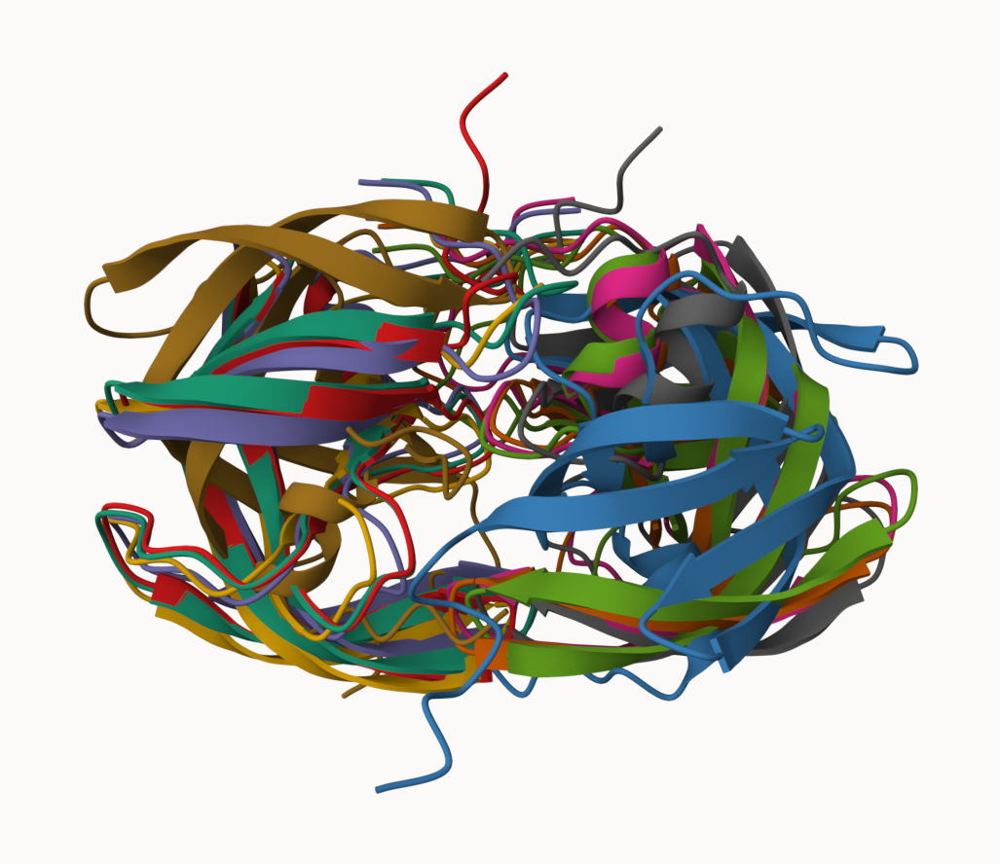
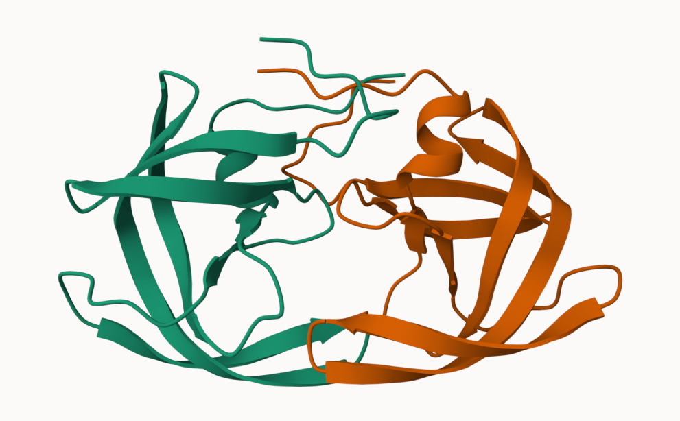
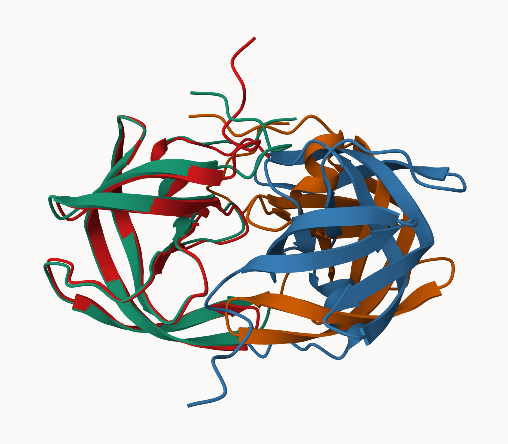
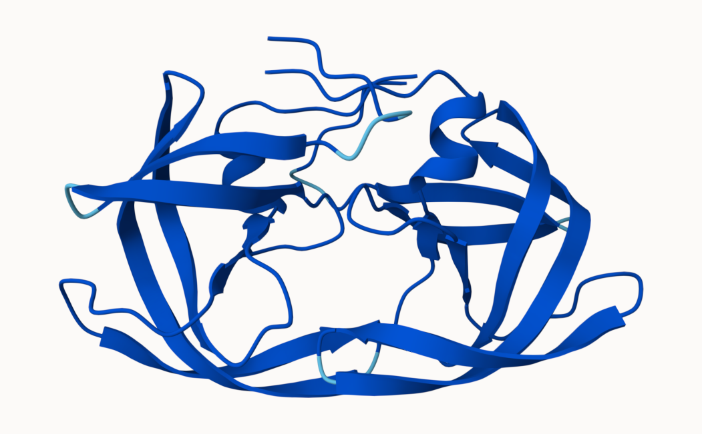

## AlphaFold Data Base (AFDB)

The EBI maintains the largest database of AlphaFold structure predicition models at: https://alphafold.ebi.ac.uk

From last class (before Halloween) we saw that the PDB had 244,290 (Oct 2025)

The total number of protein sequences in UniProtKB is 199,579,901 

>Key Point: This is a tiny fraction of sequence space that has structural coverage (0.12%)

```{r}
(244290/199579901)*100
```

AFDB is attempting to address this gap...

There are two "Quality Scores" from AlphaFold one of the residues (i.e. each amino acid) called **pLDDT score**. The other **PAE** score measures the confidence in the relative position of two residues (i.e. a score for every pair of residues).


## Generating your own structure predictions

Figure of 5 generated HIV-PR models



Figure of the first HIV-PR model



Figure of Structure 1 and 5 superimposed



Figure of top ranked model in pLDDT score


Figure of low ranked model in pLDDT score

.png)

## Custom analysis of resulting models in R

Read key results into R. The first thing I need to know is what results directory/folder is called (i.e. its name is different for every AlphaFold run/job).

```{r}
results_dir <- "test_23119_0/" 
pdb_files <- list.files(path=results_dir,
                        pattern="*.pdb",
                        full.names = TRUE)
basename(pdb_files)
```

```{r}
library(bio3d)

pdbs <- pdbaln(pdb_files, fit=TRUE, exefile="msa")
```
```{r}
pdbs
```
```{r}
rd <- rmsd(pdbs, fit=T)
range(rd)
```
```{r}
library(pheatmap)

colnames(rd) <- paste0("m",1:5)
rownames(rd) <- paste0("m",1:5)
pheatmap(rd)
```
```{r}
pdb <- read.pdb("1hsg")
plotb3(pdbs$b[1,], typ="l", lwd=2, sse=pdb)
points(pdbs$b[2,], typ="l", col="red")
points(pdbs$b[3,], typ="l", col="blue")
points(pdbs$b[4,], typ="l", col="darkgreen")
points(pdbs$b[5,], typ="l", col="orange")
abline(v=100, col="gray")
```
```{r}
core <- core.find(pdbs)
core.inds <- print(core, vol=0.5)
```
```{r}
xyz <- pdbfit(pdbs, core.inds, outpath="corefit_structures")
```

```{r}
rf <- rmsf(xyz)

plotb3(rf, sse=pdb)
abline(v=100, col="gray", ylab="RMSF")
```

```{r}
library(bio3d)
m1 <- read.pdb(pdb_files[1])
m1
```

```{r}
plot(m1$atom$b[m1$calpha], typ = "l", ylim=c(0,100))
```


## Residue conservation from allignment file

```{r}
aln_file <- list.files(path=results_dir,
                       pattern=".a3m$",
                        full.names = TRUE)
aln_file

```
```{r}
aln <- read.fasta(aln_file[1], to.upper = TRUE)
```

```{r}
dim(aln$ali)
```

```{r}
sim <- conserv(aln)
plotb3(sim[1:99], sse=trim.pdb(pdb, chain="A"),
       ylab="Conservation Score")
```


```{r}
con <- consensus(aln, cutoff = 0.9)
con$seq
```

```{r}
m1.pdb <- read.pdb(pdb_files[1])
occ <- vec2resno(c(sim[1:99], sim[1:99]), m1.pdb$atom$resno)
write.pdb(m1.pdb, o=occ, file="m1_conserv.pdb")
```


