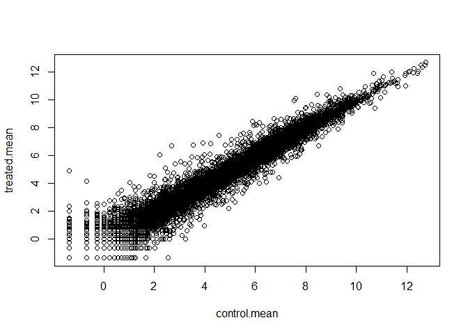

# Class 12: Transcriptomics and the analysis of RNA-Seq data
Alejandro Ostos PID: A17978684

- [Background](#background)
- [Data Import](#data-import)
- [Toy differential gene expression](#toy-differential-gene-expression)
- [DESeq2 Analysis](#deseq2-analysis)
- [Volcano Plot](#volcano-plot)
- [Save our Results](#save-our-results)
- [Add gene annotation](#add-gene-annotation)
- [Pathway analysis](#pathway-analysis)
- [Save our main results](#save-our-main-results)

## Background

Today we will analyze some RNAseq data from Himes et. al. on the effects
of a common steroid (dexamethasone) smooth on airway smooth muscle cells
(ASM cells).

Our starting point is the “counts data and”metadata” that contain the
count values for each gene in their different experiments (i.e. cell
lines with or without the drug).

## Data Import

``` r
counts <- read.csv("airway_scaledcounts (1).csv", row.names=1)
metadata <-  read.csv("airway_metadata.csv")
```

> Q1. How many genes are in this dataset?

``` r
nrow(counts)
```

    [1] 38694

> Q. How many different experiments (columns in counts or rows in
> metadata are there)

``` r
ncol(counts)
```

    [1] 8

``` r
nrow(metadata)
```

    [1] 8

``` r
metadata
```

              id     dex celltype     geo_id
    1 SRR1039508 control   N61311 GSM1275862
    2 SRR1039509 treated   N61311 GSM1275863
    3 SRR1039512 control  N052611 GSM1275866
    4 SRR1039513 treated  N052611 GSM1275867
    5 SRR1039516 control  N080611 GSM1275870
    6 SRR1039517 treated  N080611 GSM1275871
    7 SRR1039520 control  N061011 GSM1275874
    8 SRR1039521 treated  N061011 GSM1275875

> Q2. How many ‘control’ cells do we have

``` r
sum(metadata$dex == "control")
```

    [1] 4

## Toy differential gene expression

To start our analysis let’s calculate the mean counts for all genes in
the “control” experiments. 1. Extract all “control” columns from the
`counts` object. 2. Calculate the mean for all rows (i.e. genes) of
these “control” columns. 3-4. Do the same for “treated 5. Compare the
`control.mean` and `treated.mean` values

> Q3. and Q4.

``` r
control.inds <- metadata$dex == "control"
control.counts <- counts[ , control.inds]
dim(control.counts)
```

    [1] 38694     4

``` r
control.mean <- rowMeans(control.counts)
head(control.mean)
```

    ENSG00000000003 ENSG00000000005 ENSG00000000419 ENSG00000000457 ENSG00000000460 
             900.75            0.00          520.50          339.75           97.25 
    ENSG00000000938 
               0.75 

``` r
treated.inds <- metadata$dex == "treated"
treated.counts <- counts[ , treated.inds]
dim(treated.counts)
```

    [1] 38694     4

``` r
treated.mean <- rowMeans(treated.counts)
head(treated.mean)
```

    ENSG00000000003 ENSG00000000005 ENSG00000000419 ENSG00000000457 ENSG00000000460 
             658.00            0.00          546.00          316.50           78.75 
    ENSG00000000938 
               0.00 

``` r
meancounts <- data.frame(control.mean, treated.mean)
head(meancounts)
```

                    control.mean treated.mean
    ENSG00000000003       900.75       658.00
    ENSG00000000005         0.00         0.00
    ENSG00000000419       520.50       546.00
    ENSG00000000457       339.75       316.50
    ENSG00000000460        97.25        78.75
    ENSG00000000938         0.75         0.00

> Q5. You could also use the ggplot2 package to make this figure
> producing the plot below. What geom\_?() function would you use for
> this plot?

You would use geompoint.

Make a plot of control vs treated mean values for all genes

> Q6. Try plotting both axes on a log scale. What is the argument to
> plot() that allows you to do this?

``` r
plot(log(meancounts))
```



> Q7. What is the purpose of the arr.ind argument in the which()
> function call above? Why would we then take the first column of the
> output and need to call the unique() function?

arr.ind returns a matrix of column and row indices for the elements that
are TRUE.

We often talk metrics like “log2 fold-change” Let’s calculate the log2
fold change for our treated over control mean counts.

``` r
#Treated/Control
meancounts$log2fc <- log2(meancounts$treated.mean / meancounts$control.mean)
head(meancounts)
```

                    control.mean treated.mean      log2fc
    ENSG00000000003       900.75       658.00 -0.45303916
    ENSG00000000005         0.00         0.00         NaN
    ENSG00000000419       520.50       546.00  0.06900279
    ENSG00000000457       339.75       316.50 -0.10226805
    ENSG00000000460        97.25        78.75 -0.30441833
    ENSG00000000938         0.75         0.00        -Inf

A common “rule of thumb” is a log2 fold change cutoff of +2 and -2 to
call genes “Up regulated” or “Down regulated”.

> Q8. Using the up.ind vector above can you determine how many up
> regulated genes we have at the greater than 2 fc level?

Number of “up” genes

``` r
sum(meancounts$log2fc >= + 2, na.rm = T)
```

    [1] 1910

> Q9. Using the down.ind vector above can you determine how many down
> regulated genes we have at the greater than 2 fc level?

Number of “down” genes

``` r
sum(meancounts$log2fc <=  -2, na.rm = T)
```

    [1] 2330

> Q10. Do you trust these results? Why or why not?

Even if this gives us slight information about the up and down regulated
genes, we cannot be certain that these results give us a statistically
correct answer. We are only looking at how many are up and down
regulated, but not by how much or how significant this up and down
regulations are.

## DESeq2 Analysis

Let’s do this analysis properly and keep up our inner stats nerd happy,
i.e. are there differences we see between drug and no drug significant
given the replicate experiments.

``` r
library(DESeq2)
```

    Warning: package 'matrixStats' was built under R version 4.5.2

``` r
citation("DESeq2")
```

    To cite package 'DESeq2' in publications use:

      Love, M.I., Huber, W., Anders, S. Moderated estimation of fold change
      and dispersion for RNA-seq data with DESeq2 Genome Biology 15(12):550
      (2014)

    A BibTeX entry for LaTeX users is

      @Article{,
        title = {Moderated estimation of fold change and dispersion for RNA-seq data with DESeq2},
        author = {Michael I. Love and Wolfgang Huber and Simon Anders},
        year = {2014},
        journal = {Genome Biology},
        doi = {10.1186/s13059-014-0550-8},
        volume = {15},
        issue = {12},
        pages = {550},
      }

For DESeq analysis we need three things

- count values (`contData`)
- metadata telling us about the columns in `countData` (`colData`)
- design of the experiment (i.e. what do you want to compare)

Our first function from DESeq2 will setup the input required for
analysis by sorting all these 3 things together.

``` r
dds <- DESeqDataSetFromMatrix(countData=counts, 
                              colData=metadata, 
                              design=~dex)
```

    converting counts to integer mode

    Warning in DESeqDataSet(se, design = design, ignoreRank): some variables in
    design formula are characters, converting to factors

The main function in DESeq2 that runs the analysis is called `DESeq()`

``` r
dds <- DESeq(dds)
```

    estimating size factors

    estimating dispersions

    gene-wise dispersion estimates

    mean-dispersion relationship

    final dispersion estimates

    fitting model and testing

``` r
res <- results(dds)
head(res)
```

    log2 fold change (MLE): dex treated vs control 
    Wald test p-value: dex treated vs control 
    DataFrame with 6 rows and 6 columns
                      baseMean log2FoldChange     lfcSE      stat    pvalue
                     <numeric>      <numeric> <numeric> <numeric> <numeric>
    ENSG00000000003 747.194195     -0.3507030  0.168246 -2.084470 0.0371175
    ENSG00000000005   0.000000             NA        NA        NA        NA
    ENSG00000000419 520.134160      0.2061078  0.101059  2.039475 0.0414026
    ENSG00000000457 322.664844      0.0245269  0.145145  0.168982 0.8658106
    ENSG00000000460  87.682625     -0.1471420  0.257007 -0.572521 0.5669691
    ENSG00000000938   0.319167     -1.7322890  3.493601 -0.495846 0.6200029
                         padj
                    <numeric>
    ENSG00000000003  0.163035
    ENSG00000000005        NA
    ENSG00000000419  0.176032
    ENSG00000000457  0.961694
    ENSG00000000460  0.815849
    ENSG00000000938        NA

## Volcano Plot

This is a common summary result figure from these types of experiments
and plot the log2 fold-change vs the adjusted p-value.

``` r
plot(res$log2FoldChange, -log(res$padj))
abline(v=c(-2, 2), col="red")
abline(h=-log(0.04), col="red")
```


## Save our Results

``` r
write.csv(res, file="my_results.csv")
```

## Add gene annotation

To help make sense of our results and comunicate them to other folks we
need to add some more annotation to our main `res` object.

We will use two bioconductor packages to first map IDs to different
formats including the classic gene “symbol” gene name.

``` r
library(AnnotationDbi)
library(org.Hs.eg.db)
```

Let’s see what is in `org.Hs.eg.db` with the `columns()` function:

``` r
columns(org.Hs.eg.db)
```

     [1] "ACCNUM"       "ALIAS"        "ENSEMBL"      "ENSEMBLPROT"  "ENSEMBLTRANS"
     [6] "ENTREZID"     "ENZYME"       "EVIDENCE"     "EVIDENCEALL"  "GENENAME"    
    [11] "GENETYPE"     "GO"           "GOALL"        "IPI"          "MAP"         
    [16] "OMIM"         "ONTOLOGY"     "ONTOLOGYALL"  "PATH"         "PFAM"        
    [21] "PMID"         "PROSITE"      "REFSEQ"       "SYMBOL"       "UCSCKG"      
    [26] "UNIPROT"     

We can translate our “map” IDs between any of the 26 databases using the
`mapIds()` function.

``` r
res$symbol <- mapIds(keys = row.names(res), # Our current IDs
                    keytype = "ENSEMBL",   # The format of our IDs
                    x = org.Hs.eg.db,      # where to get the mappings from
                    column = "SYMBOL")
```

    'select()' returned 1:many mapping between keys and columns

``` r
head(res)
```

    log2 fold change (MLE): dex treated vs control 
    Wald test p-value: dex treated vs control 
    DataFrame with 6 rows and 7 columns
                      baseMean log2FoldChange     lfcSE      stat    pvalue
                     <numeric>      <numeric> <numeric> <numeric> <numeric>
    ENSG00000000003 747.194195     -0.3507030  0.168246 -2.084470 0.0371175
    ENSG00000000005   0.000000             NA        NA        NA        NA
    ENSG00000000419 520.134160      0.2061078  0.101059  2.039475 0.0414026
    ENSG00000000457 322.664844      0.0245269  0.145145  0.168982 0.8658106
    ENSG00000000460  87.682625     -0.1471420  0.257007 -0.572521 0.5669691
    ENSG00000000938   0.319167     -1.7322890  3.493601 -0.495846 0.6200029
                         padj      symbol
                    <numeric> <character>
    ENSG00000000003  0.163035      TSPAN6
    ENSG00000000005        NA        TNMD
    ENSG00000000419  0.176032        DPM1
    ENSG00000000457  0.961694       SCYL3
    ENSG00000000460  0.815849       FIRRM
    ENSG00000000938        NA         FGR

Add the mappings for “GENENAME” and “ENTREZID” and store as
`res$genename`and `res$entrez`

``` r
res$genename <- mapIds(keys = row.names(res), # Our current IDs
                    keytype = "ENSEMBL",   # The format of our IDs
                    x = org.Hs.eg.db,      # where to get the mappings from
                    column = "GENENAME")
```

    'select()' returned 1:many mapping between keys and columns

``` r
res$entrez <- mapIds(keys = row.names(res), # Our current IDs
                    keytype = "ENSEMBL",   # The format of our IDs
                    x = org.Hs.eg.db,      # where to get the mappings from
                    column = "ENTREZID")
```

    'select()' returned 1:many mapping between keys and columns

``` r
head(res$genename)
```

                                                  ENSG00000000003 
                                                  "tetraspanin 6" 
                                                  ENSG00000000005 
                                                    "tenomodulin" 
                                                  ENSG00000000419 
    "dolichyl-phosphate mannosyltransferase subunit 1, catalytic" 
                                                  ENSG00000000457 
                                       "SCY1 like pseudokinase 3" 
                                                  ENSG00000000460 
      "FIGNL1 interacting regulator of recombination and mitosis" 
                                                  ENSG00000000938 
                 "FGR proto-oncogene, Src family tyrosine kinase" 

``` r
head(res$entrez)
```

    ENSG00000000003 ENSG00000000005 ENSG00000000419 ENSG00000000457 ENSG00000000460 
             "7105"         "64102"          "8813"         "57147"         "55732" 
    ENSG00000000938 
             "2268" 

## Pathway analysis

There are lots of bioconductor packages to do this type of analysis. For
now let’s try one called *gauge*.

``` r
library(gage)
library(gageData)
library(pathview)
```

To use **gage** I need two things

- A named vector of DEGs (our geneset of interest)
- A set of pathways or genesets to use for annotation

``` r
foldchanges <- res$log2FoldChange
names(foldchanges) <- res$entrez
head(foldchanges)
```

           7105       64102        8813       57147       55732        2268 
    -0.35070302          NA  0.20610777  0.02452695 -0.14714205 -1.73228897 

``` r
data(kegg.sets.hs)
keggres = gage(foldchanges, gsets=kegg.sets.hs)
```

In our results we have:

``` r
attributes(keggres)
```

    $names
    [1] "greater" "less"    "stats"  

``` r
head(keggres$less, 5)
```

                                                             p.geomean stat.mean
    hsa05332 Graft-versus-host disease                    0.0004250461 -3.473346
    hsa04940 Type I diabetes mellitus                     0.0017820293 -3.002352
    hsa05310 Asthma                                       0.0020045888 -3.009050
    hsa04672 Intestinal immune network for IgA production 0.0060434515 -2.560547
    hsa05330 Allograft rejection                          0.0073678825 -2.501419
                                                                 p.val      q.val
    hsa05332 Graft-versus-host disease                    0.0004250461 0.09053483
    hsa04940 Type I diabetes mellitus                     0.0017820293 0.14232581
    hsa05310 Asthma                                       0.0020045888 0.14232581
    hsa04672 Intestinal immune network for IgA production 0.0060434515 0.31387180
    hsa05330 Allograft rejection                          0.0073678825 0.31387180
                                                          set.size         exp1
    hsa05332 Graft-versus-host disease                          40 0.0004250461
    hsa04940 Type I diabetes mellitus                           42 0.0017820293
    hsa05310 Asthma                                             29 0.0020045888
    hsa04672 Intestinal immune network for IgA production       47 0.0060434515
    hsa05330 Allograft rejection                                36 0.0073678825

Let’s look at one of these pathways with our genes colored up so we can
see the overlap.

``` r
pathview(gene.data=foldchanges, pathway.id="hsa05310")
```

    'select()' returned 1:1 mapping between keys and columns

    Info: Working in directory C:/BIMM143/bimm143_github/class12

    Info: Writing image file hsa05310.pathview.png

Add this pathway figure to our lab report


## Save our main results

``` r
write.csv(res, file = "myresults_annotated.csv")
```
