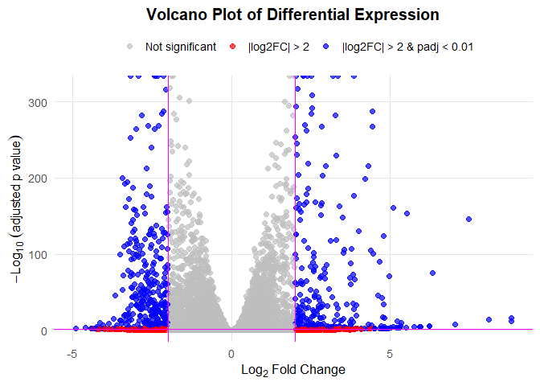

# Class 14: RNASeq mini project
Alejandro Ostos A17978684

- [Background](#background)
- [Data Import](#data-import)
  - [Remove zero count genes](#remove-zero-count-genes)
- [DESeq analysis](#deseq-analysis)
- [Data Visualization](#data-visualization)
- [Add Annotation](#add-annotation)
- [Pathway Analysis](#pathway-analysis)
  - [GO terms](#go-terms)
  - [Reactome](#reactome)
- [Save our results](#save-our-results)

## Background

## Data Import

Reading the `counts` and `metadata` CSV file

``` r
counts <- read.csv("GSE37704_featurecounts.csv", row.names = 1)
metadata <- read.csv("GSE37704_metadata.csv")
```

``` r
head(counts)
```

                    length SRR493366 SRR493367 SRR493368 SRR493369 SRR493370
    ENSG00000186092    918         0         0         0         0         0
    ENSG00000279928    718         0         0         0         0         0
    ENSG00000279457   1982        23        28        29        29        28
    ENSG00000278566    939         0         0         0         0         0
    ENSG00000273547    939         0         0         0         0         0
    ENSG00000187634   3214       124       123       205       207       212
                    SRR493371
    ENSG00000186092         0
    ENSG00000279928         0
    ENSG00000279457        46
    ENSG00000278566         0
    ENSG00000273547         0
    ENSG00000187634       258

``` r
metadata
```

             id     condition
    1 SRR493366 control_sirna
    2 SRR493367 control_sirna
    3 SRR493368 control_sirna
    4 SRR493369      hoxa1_kd
    5 SRR493370      hoxa1_kd
    6 SRR493371      hoxa1_kd

``` r
ncol(counts)
```

    [1] 7

``` r
nrow(metadata)
```

    [1] 6

Looks like we need to get rid of the first “length” column of our
`counts`object.

``` r
cleancounts <- counts[,-1]
head(cleancounts)
```

                    SRR493366 SRR493367 SRR493368 SRR493369 SRR493370 SRR493371
    ENSG00000186092         0         0         0         0         0         0
    ENSG00000279928         0         0         0         0         0         0
    ENSG00000279457        23        28        29        29        28        46
    ENSG00000278566         0         0         0         0         0         0
    ENSG00000273547         0         0         0         0         0         0
    ENSG00000187634       124       123       205       207       212       258

``` r
colnames(cleancounts)
```

    [1] "SRR493366" "SRR493367" "SRR493368" "SRR493369" "SRR493370" "SRR493371"

``` r
colnames(cleancounts) == metadata$id
```

    [1] TRUE TRUE TRUE TRUE TRUE TRUE

### Remove zero count genes

There are lots of genes with zero counts. We can remove these from
furthrt analysis.

``` r
head(cleancounts)
```

                    SRR493366 SRR493367 SRR493368 SRR493369 SRR493370 SRR493371
    ENSG00000186092         0         0         0         0         0         0
    ENSG00000279928         0         0         0         0         0         0
    ENSG00000279457        23        28        29        29        28        46
    ENSG00000278566         0         0         0         0         0         0
    ENSG00000273547         0         0         0         0         0         0
    ENSG00000187634       124       123       205       207       212       258

``` r
to.keep.inds <- rowSums(cleancounts) > 0
nonzero_counts <- cleancounts[to.keep.inds,]
```

## DESeq analysis

``` r
library(DESeq2)
```

    Warning: package 'matrixStats' was built under R version 4.5.2

``` r
dds <- DESeqDataSetFromMatrix(countData= nonzero_counts,
                             colData= metadata,
                             design= ~condition)
```

    Warning in DESeqDataSet(se, design = design, ignoreRank): some variables in
    design formula are characters, converting to factors

Get Results

``` r
dds <- DESeq(dds)
```

    estimating size factors

    estimating dispersions

    gene-wise dispersion estimates

    mean-dispersion relationship

    final dispersion estimates

    fitting model and testing

``` r
res <- results(dds)
res
```

    log2 fold change (MLE): condition hoxa1 kd vs control sirna 
    Wald test p-value: condition hoxa1 kd vs control sirna 
    DataFrame with 15975 rows and 6 columns
                     baseMean log2FoldChange     lfcSE       stat      pvalue
                    <numeric>      <numeric> <numeric>  <numeric>   <numeric>
    ENSG00000279457   29.9136      0.1792571 0.3248216   0.551863 5.81042e-01
    ENSG00000187634  183.2296      0.4264571 0.1402658   3.040350 2.36304e-03
    ENSG00000188976 1651.1881     -0.6927205 0.0548465 -12.630158 1.43990e-36
    ENSG00000187961  209.6379      0.7297556 0.1318599   5.534326 3.12428e-08
    ENSG00000187583   47.2551      0.0405765 0.2718928   0.149237 8.81366e-01
    ...                   ...            ...       ...        ...         ...
    ENSG00000273748  35.30265       0.674387  0.303666   2.220817 2.63633e-02
    ENSG00000278817   2.42302      -0.388988  1.130394  -0.344117 7.30758e-01
    ENSG00000278384   1.10180       0.332991  1.660261   0.200565 8.41039e-01
    ENSG00000276345  73.64496      -0.356181  0.207716  -1.714752 8.63908e-02
    ENSG00000271254 181.59590      -0.609667  0.141320  -4.314071 1.60276e-05
                           padj
                      <numeric>
    ENSG00000279457 6.86555e-01
    ENSG00000187634 5.15718e-03
    ENSG00000188976 1.76549e-35
    ENSG00000187961 1.13413e-07
    ENSG00000187583 9.19031e-01
    ...                     ...
    ENSG00000273748 4.79091e-02
    ENSG00000278817 8.09772e-01
    ENSG00000278384 8.92654e-01
    ENSG00000276345 1.39762e-01
    ENSG00000271254 4.53648e-05

## Data Visualization

Volcano plot

``` r
library(ggplot2)

res$color <- "gray"  # default
res$color[abs(res$log2FoldChange) > 2] <- "red"
res$color[(res$padj < 0.01) & (abs(res$log2FoldChange) > 2)] <- "blue"

# Create a volcano plot with ggplot2
ggplot(res, aes(x = log2FoldChange, y = -log10(padj), color = color)) +
  geom_point(alpha = 0.7, size = 2) +
  
  # Threshold lines
  geom_vline(xintercept = c(-2, 2), color = "magenta", linewidth = 0.7) +
  geom_hline(yintercept = -log10(0.1), color = "magenta", linewidth = 0.7) +
  
  # Custom color scale (keep your gray-red-blue scheme)
  scale_color_identity(
    guide = "legend",
    breaks = c("gray", "red", "blue"),
    labels = c("Not significant", "|log2FC| > 2", "|log2FC| > 2 & padj < 0.01"),
    name = ""
  ) +
  
  # Labels and theme
  labs(
    title = "Volcano Plot of Differential Expression",
    x = expression(Log[2]~Fold~Change),
    y = expression(-Log[10]~(adjusted~p~value))
  ) +
  
  theme_minimal(base_size = 13) +
  theme(
    plot.title = element_text(face = "bold", size = 15, hjust = 0.5),
    legend.position = "top",
    panel.grid.minor = element_blank(),
    panel.grid.major = element_line(color = "gray90")
  )
```

    Warning: Removed 1237 rows containing missing values or values outside the scale range
    (`geom_point()`).



Add Threshold lines for fold-change and P-value and color our subset of
genes that make these threshold cut-offs in the plot.

## Add Annotation

Add gene symbols and entrez ids

``` r
library(AnnotationDbi)
library(org.Hs.eg.db)
```

``` r
res$symbol <- mapIds(x = org.Hs.eg.db,
                    keys = row.names(res),
                    keytype = "ENSEMBL",
                    column = "SYMBOL")
```

    'select()' returned 1:many mapping between keys and columns

``` r
res$entrez <- mapIds(x = org.Hs.eg.db,
                    keys = row.names(res),
                    keytype = "ENSEMBL",
                    column = "ENTREZID")
```

    'select()' returned 1:many mapping between keys and columns

## Pathway Analysis

Run gage analysis \### KEGG terms

``` r
 library(gage)
```

``` r
 library(gageData)
 library(pathview)
```

    ##############################################################################
    Pathview is an open source software package distributed under GNU General
    Public License version 3 (GPLv3). Details of GPLv3 is available at
    http://www.gnu.org/licenses/gpl-3.0.html. Particullary, users are required to
    formally cite the original Pathview paper (not just mention it) in publications
    or products. For details, do citation("pathview") within R.

    The pathview downloads and uses KEGG data. Non-academic uses may require a KEGG
    license agreement (details at http://www.kegg.jp/kegg/legal.html).
    ##############################################################################

We need a named vector of fold-change values as input for gage

``` r
foldchanges = res$log2FoldChange
names(foldchanges) = res$entrez
head(foldchanges)
```

           <NA>      148398       26155      339451       84069       84808 
     0.17925708  0.42645712 -0.69272046  0.72975561  0.04057653  0.54281049 

``` r
data(kegg.sets.hs)


keggres = gage(foldchanges, gsets=kegg.sets.hs)
head(keggres$less, 5)
```

                                                      p.geomean stat.mean
    hsa04110 Cell cycle                            8.995727e-06 -4.378644
    hsa03030 DNA replication                       9.424076e-05 -3.951803
    hsa05130 Pathogenic Escherichia coli infection 1.405864e-04 -3.765330
    hsa03013 RNA transport                         1.246882e-03 -3.059466
    hsa03440 Homologous recombination              3.066756e-03 -2.852899
                                                          p.val       q.val
    hsa04110 Cell cycle                            8.995727e-06 0.001889103
    hsa03030 DNA replication                       9.424076e-05 0.009841047
    hsa05130 Pathogenic Escherichia coli infection 1.405864e-04 0.009841047
    hsa03013 RNA transport                         1.246882e-03 0.065461279
    hsa03440 Homologous recombination              3.066756e-03 0.128803765
                                                   set.size         exp1
    hsa04110 Cell cycle                                 121 8.995727e-06
    hsa03030 DNA replication                             36 9.424076e-05
    hsa05130 Pathogenic Escherichia coli infection       53 1.405864e-04
    hsa03013 RNA transport                              144 1.246882e-03
    hsa03440 Homologous recombination                    28 3.066756e-03

``` r
pathview(gene.data=foldchanges, pathway.id="hsa04110")
```

    'select()' returned 1:1 mapping between keys and columns

    Info: Working in directory C:/BIMM143/bimm143_github/class14

    Info: Writing image file hsa04110.pathview.png


### GO terms

Same analysis but using GO genesets rather than KEGG

``` r
data(go.sets.hs)
data(go.subs.hs)

# Focus on Biological Process subset of GO
gobpsets = go.sets.hs[go.subs.hs$BP]

gobpres = gage(foldchanges, gsets=gobpsets, same.dir=TRUE)

head(gobpres$less, 4)
```

                                                p.geomean stat.mean        p.val
    GO:0048285 organelle fission             1.536227e-15 -8.063910 1.536227e-15
    GO:0000280 nuclear division              4.286961e-15 -7.939217 4.286961e-15
    GO:0007067 mitosis                       4.286961e-15 -7.939217 4.286961e-15
    GO:0000087 M phase of mitotic cell cycle 1.169934e-14 -7.797496 1.169934e-14
                                                    q.val set.size         exp1
    GO:0048285 organelle fission             5.841698e-12      376 1.536227e-15
    GO:0000280 nuclear division              5.841698e-12      352 4.286961e-15
    GO:0007067 mitosis                       5.841698e-12      352 4.286961e-15
    GO:0000087 M phase of mitotic cell cycle 1.195672e-11      362 1.169934e-14

### Reactome

Lots of folks like the reactome web interface. You can also run this as
an R function but letss look at the website first.
<https://reactome.org/>

The Website wants a text file with one gene symbol per line of the genes
you want to map to pathways.

``` r
sig_genes <- res[res$padj <= 0.05 & !is.na(res$padj), "symbol"]
```

And write out a file:

``` r
write.table(sig_genes, file="significant_genes.txt", row.names=FALSE, col.names=FALSE, quote=FALSE)
```

## Save our results

``` r
write.csv(res, file = "myresults.csv")
```
